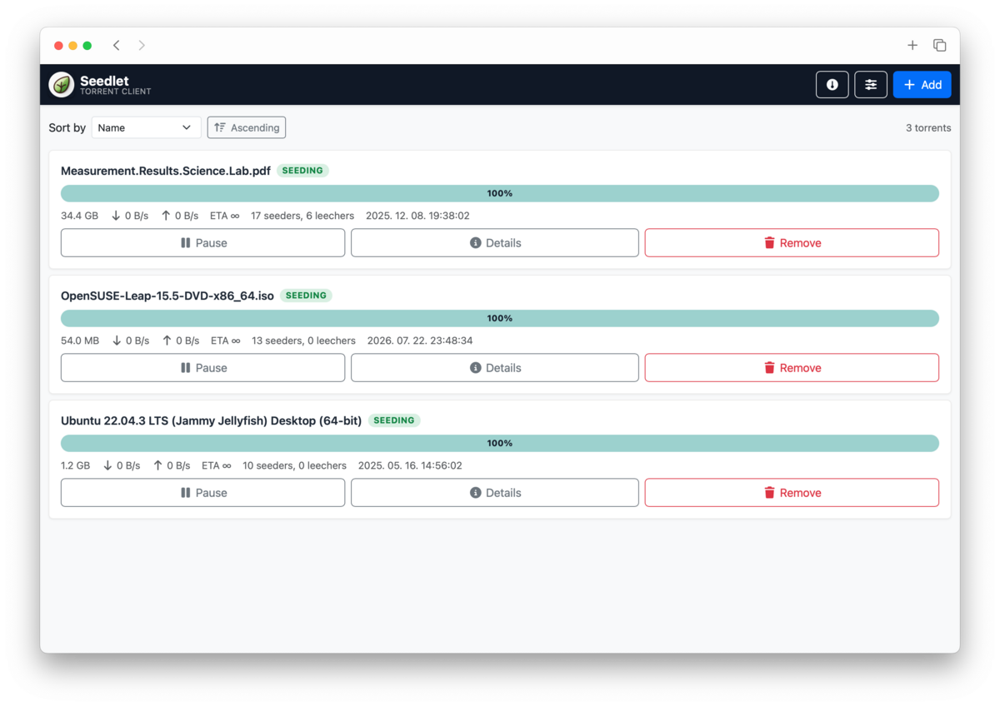

<p align="center">
    
</p>
<p align="center">
    <a href="https://github.com/antalaron/seedlet/actions/workflows/check.yaml?query=branch:master+event:schedule"></a>
    <a href="https://codecov.io/github/antalaron/seedlet"></a>
</p>

# Seedlet

Seedlet is a web frontend for the [Transmission](https://transmissionbt.com/) BitTorrent
client. It talks to a running Transmission daemon over its RPC API and lets you add, list,
inspect and control torrents (pause/resume, file selection, remove, speed/session settings)
from a browser.



## Technologies

- Backend: PHP 8.4, [Symfony](https://symfony.com/) 8.1, Twig
- Frontend: vanilla JavaScript modules, Bootstrap 5, Sass, bundled with
  [Webpack Encore](https://symfony.com/doc/current/frontend.html)
- Tests: PHPUnit

## Requirements

- PHP >= 8.4 with the `ctype` and `iconv` extensions, and [Composer](https://getcomposer.org/)
- Node.js 22 and Yarn
- A running Transmission daemon with RPC enabled

## Configuration

Copy your local overrides into `.env.local` (already present, empty by default) and set at
least:

```
APP_SECRET=change-me
TRANSMISSION_URL=http://localhost:9091/transmission/rpc
TRANSMISSION_USERNAME=
TRANSMISSION_PASSWORD=
TRANSMISSION_TIMEOUT=10
```

`TRANSMISSION_URL` must point at your Transmission daemon's RPC endpoint. Leave the username
and password empty if RPC authentication is disabled. See [.env](.env) for all defaults.

## Running the application

```
make deploy         # install PHP/JS dependencies, build dev assets, warm up the cache
```

And point the webserver at the `public/` directory.

## Development

```
make start          # install PHP/JS dependencies, build dev assets, warm up the cache
php -S 127.0.0.1:8000 -t public
```

Then open http://127.0.0.1:8000 in your browser.

Use `make watch` while developing the frontend to rebuild assets on change.

## Checks and tests

```
make check     # PHP-CS-Fixer and semistandard (JS) checks
make test      # PHPUnit unit and functional tests
```

See `make help` for the full list of available commands.

## Documentation

More detailed technical documentation is available in [docs/](docs/).

## License

This project is licensed under the MIT License - see the [LICENSE](LICENSE) file for details.
